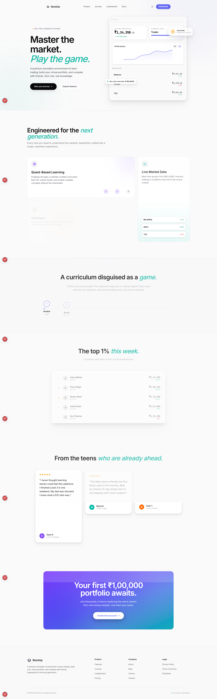

# StockUp — Learn. Trade. Level Up.

StockUp is a gamified stock market learning platform designed specifically for Indian teenagers. It provides a safe, virtual environment to practice paper trading on NSE/BSE stocks, learn financial literacy through structured lessons, and compete with friends in squads and duels.



## 🚀 Features

- **Virtual Trading Engine**: Buy and sell Indian stocks in real-time with a simulated ₹100,000 starting balance.
- **Gamified Learning**: Complete lessons, take quizzes, and earn XP to level up from Level 1 to Level 7.
- **Social Squads & Duels**: Join friends in "Squads", pool XP, and challenge other users to 1v1 trading duels.
- **AI StockBot**: A built-in AI mentor powered by Gemini that answers financial questions and analyzes the market.
- **Real Money Unlock**: A compliance-first state machine for KYC, parental consent, and broker linking (Zerodha, Groww) to transition from paper trading to real investing once Level 10 is reached.
- **Dynamic Leaderboards**: Compete globally or within your squad.
- **Robust Profiles**: Customizable privacy settings, themes, and badge showcases.

## 💻 Tech Stack

- **Framework**: [Next.js 14](https://nextjs.org/) (App Router)
- **Language**: TypeScript
- **Database**: [Neon Serverless Postgres](https://neon.tech/) + [Prisma ORM](https://www.prisma.io/)
- **Caching & Rate Limiting**: [Upstash Redis](https://upstash.com/)
- **Authentication**: [NextAuth.js (Auth.js v5)](https://authjs.dev/) with Google OAuth
- **Styling**: Tailwind CSS + Framer Motion
- **AI Integration**: Google Generative AI (Gemini)
- **Market Data**: Alpha Vantage API
- **Emails**: Resend
- **Analytics**: PostHog

---

## 🚀 Quick Setup Guide

### 1. Clone the repository
```bash
git clone https://github.com/Shubham11440/Stock-Market-Learning-Platform-for-Teenagers.git
cd Stock-Market-Learning-Platform-for-Teenagers
npm install
```

### 2. Environment Variables Setup
Create a `.env` file in the root directory. You will need to create accounts on the following platforms to get your API keys:

#### Database & Caching
- **Neon (PostgreSQL)**: Create a free database at [neon.tech](https://neon.tech/). Get your connection string.
  - `DATABASE_URL="postgresql://..."`
- **Upstash (Redis)**: Create a free Redis database at [upstash.com](https://upstash.com/). Get the REST URL and Token.
  - `UPSTASH_REDIS_REST_URL="..."`
  - `UPSTASH_REDIS_REST_TOKEN="..."`

#### Authentication (NextAuth)
- Generate a random secret for NextAuth using: `openssl rand -base64 32`
  - `NEXTAUTH_SECRET="..."`
  - `NEXTAUTH_URL="http://localhost:3000"`
- **Google OAuth**: Go to [Google Cloud Console](https://console.cloud.google.com/), create credentials for an OAuth client ID.
  - `GOOGLE_CLIENT_ID="..."`
  - `GOOGLE_CLIENT_SECRET="..."`

#### APIs & Services
- **Alpha Vantage**: Get a free API key at [alphavantage.co](https://www.alphavantage.co/support/#api-key) for real-time stock data.
  - `ALPHA_VANTAGE_API_KEY="..."`
- **Google Gemini**: Get an API key at [Google AI Studio](https://aistudio.google.com/) for the AI StockBot.
  - `GOOGLE_GEMINI_API_KEY="..."`
- **Resend**: Get an API key at [resend.com](https://resend.com/) for email notifications.
  - `RESEND_API_KEY="..."`
  - `RESEND_FROM_EMAIL="noreply@yourdomain.com"`
- **Cloudinary**: Get credentials at [cloudinary.com](https://cloudinary.com/) for image uploads.
  - `CLOUDINARY_CLOUD_NAME="..."`
  - `CLOUDINARY_API_KEY="..."`
  - `CLOUDINARY_API_SECRET="..."`
- **PostHog**: Get credentials at [posthog.com](https://posthog.com/) for analytics.
  - `NEXT_PUBLIC_POSTHOG_KEY="..."`
  - `NEXT_PUBLIC_POSTHOG_HOST="https://us.i.posthog.com"`

#### App Configuration
- `NEXT_PUBLIC_APP_NAME="StockUp"`
- `NEXT_PUBLIC_APP_URL="http://localhost:3000"`

### 3. Initialize Database
```bash
npm run db:push
npm run db:generate
```

### 4. Run the App
```bash
npm run dev
```
Your app should now be running on `http://localhost:3000`.

---

## 🚀 Deployment

This project is optimized for deployment on [Vercel](https://vercel.com).
Simply connect your GitHub repository to Vercel, ensure all environment variables are populated in the Vercel dashboard, and deploy. The build command `npm run build` will handle everything.

## 📜 License
This project is licensed under the MIT License.

## 👨‍💻 Author
Built by Shubham Mali.
