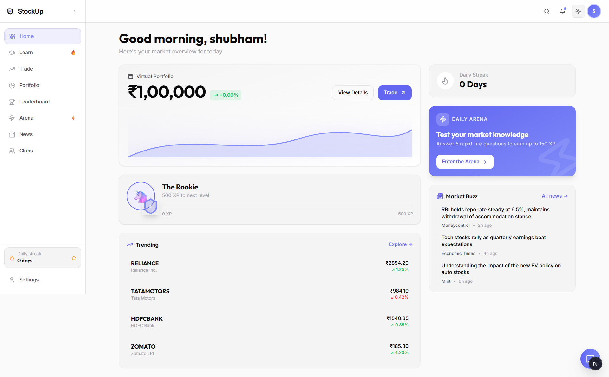
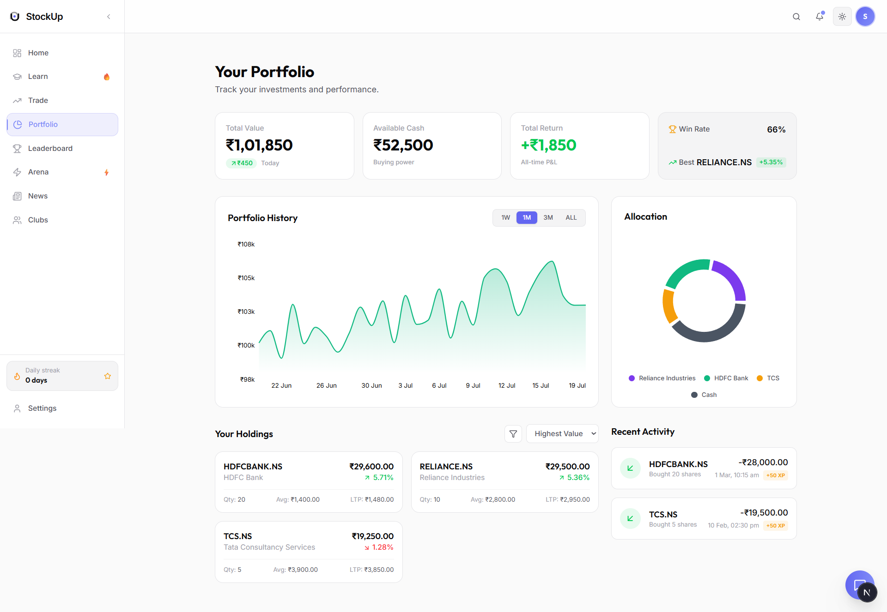
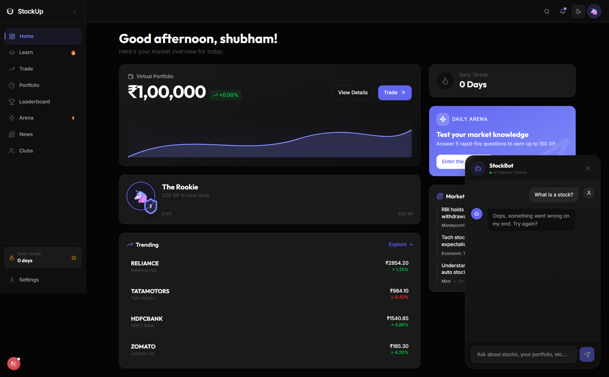
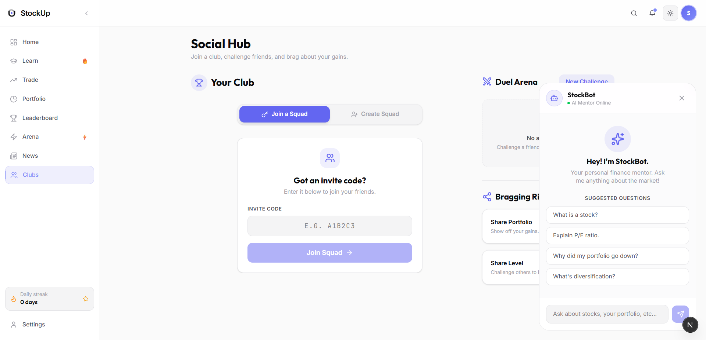
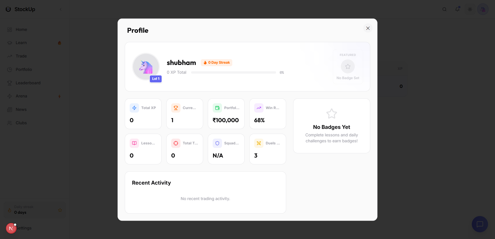

# StockUp — Learn. Trade. Level Up.

StockUp is a gamified stock market learning platform designed specifically for Indian teenagers. It provides a safe, virtual environment to practice paper trading on NSE/BSE stocks, learn financial literacy through structured lessons, and compete with friends in squads and duels.


## 🚀 Features

- **Virtual Trading Engine**: Buy and sell Indian stocks in real-time with a simulated ₹100,000 starting balance.
- **Gamified Learning**: Complete lessons, take quizzes, and earn XP to level up from Level 1 to Level 7.
- **Social Squads & Duels**: Join friends in "Squads", pool XP, and challenge other users to 1v1 trading duels.
- **AI StockBot**: A built-in AI mentor powered by Gemini that answers financial questions and analyzes the market.
- **Real Money Unlock**: A compliance-first state machine for KYC, parental consent, and broker linking (Zerodha, Groww) to transition from paper trading to real investing once Level 10 is reached.
- **Dynamic Leaderboards**: Compete globally or within your squad.
- **Robust Profiles**: Customizable privacy settings, themes, and badge showcases.

## 🏗️ Architecture

```text
Next.js App Router (React 19)
        │
 ┌──────┼──────────┐
 │      │          │
Server  Client   Server Actions
 │      │          │
 └──────┼──────────┘
        │
   Domain Services
 ┌───┬────┬────┬────┐
 │AI │Trade│Social│Profile│
 └───┴────┴────┴────┘
        │
     Prisma ORM
        │
 Neon PostgreSQL
```

## 💻 Tech Stack

- **Framework**: [Next.js 16](https://nextjs.org/) (App Router)
- **Language**: TypeScript
- **Database**: [Neon Serverless Postgres](https://neon.tech/) + [Prisma ORM](https://www.prisma.io/)
- **Authentication**: [NextAuth.js (Auth.js v5)](https://authjs.dev/)
- **Styling**: Tailwind CSS + Shadcn UI
- **AI Integration**: Google Generative AI (Gemini)
- **Market Data**: Yahoo Finance API Wrapper
- **Emails**: Resend

## 📁 Folder Structure

```
├── actions/        # Server actions for mutations
├── app/            # Next.js App Router (pages, layouts, api)
├── components/     # UI components (shared, features, ui)
├── lib/            # Domain logic, utilities, DB config
├── prisma/         # Database schema and migrations
├── public/         # Static assets (images, icons)
└── types/          # Global TypeScript interfaces
```

## 🛠️ Setup Instructions

1. **Clone the repository:**
   ```bash
   git clone https://github.com/your-username/stockup.git
   cd stockup
   ```

2. **Install dependencies:**
   ```bash
   npm install
   ```

3. **Configure Environment Variables:**
   Copy the example environment file and fill in your keys.
   ```bash
   cp .env.example .env
   ```
   *(See the Environment Variables section below for details)*

4. **Initialize the Database:**
   ```bash
   npx prisma db push
   npx prisma generate
   ```

5. **Run the Development Server:**
   ```bash
   npm run dev
   ```
   The application will be available at `http://localhost:3000`.

## 🔐 Environment Variables

Please refer to `.env.example` for the required keys. Strict startup validation is enforced using `zod`. The app will crash immediately if required keys (`DATABASE_URL`, `NEXTAUTH_SECRET`, etc.) are missing.

## 📸 Screenshots

| Dashboard | Portfolio |
| :---: | :---: |
|  |  |

| AI StockBot | Social Squads |
| :---: | :---: |
|  |  |

| Public Profile |
| :---: |
|  |

## 🚀 Deployment

This project is optimized for deployment on [Vercel](https://vercel.com).
Simply connect your GitHub repository to Vercel and ensure all environment variables are populated in the Vercel dashboard. The build command `npm run build` will handle everything.

## 🗺️ Future Roadmap

- Real Broker Integrations (Zerodha Kite Connect, Upstox API)
- Live WebSocket Data Feeds
- Advanced Options Trading Simulator
- Interactive Multi-player Minigames

## 📜 License

This project is licensed under the MIT License.

## 👨‍💻 Author

Built by the StockUp Team.
